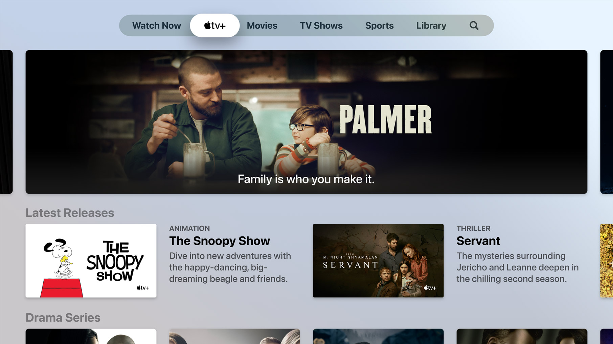

# position : sticky 
Edge 이상에서 사용가능
- 스크롤이 되었을 때 화면에 고정되는 요소를 만들고 싶을 때 사용할 수 있는 CSS 속성
- position : fixed 는 항상 화면에 고정이 되는 요소를 만들 때 사용
- position : sticky 는 스크롤이 되어서 이 요소가 화면에 나오면 고정시킨다는 특성

<br>

```html
<!DOCTYPE html>
<html lang="en">
<head>
    <meta charset="UTF-8">
    <meta name="viewport" content="width=device-width, initial-scale=1.0">
    <title>Document</title>
    <link rel="stylesheet" href="main.css">
</head>
<body style="background : grey; height : 3000px">

    <div class="grey">
      <div class="image">
        
      </div>
    
      <div style="clear : both"></div>
      <div class="text">
        Meet the first Triple Camera System
      </div>

      <div style="clear : both"></div>
      <div class="text" style="margin-top: 300px;">
        Meet the first Triple Camera System
      </div>

      <div style="clear : both"></div>
      <div class="text" style="margin-top: 300px;">
        Meet the first Triple Camera System
      </div>
    
    </div>
    
    </body>
</html>
```
검고 긴 화면에 텍스트와 이미지가 하나씩 보임  
이미지에 position : sticky를 주면
1. 스크롤이 되어서 이미지가 보이는 순간
2. viewport의 맨 위에서부터 100px 위치에서 고정
3. 그리고 부모 박스를 넘어서 스크롤 되면 이미지도 같이 사라짐

<br>

### 주의점
position : sticky
1. 스크롤을 할 만한 부모 박스가 있어야하고
2. top 등 좌표속성과 함께 써야 제대로 보임