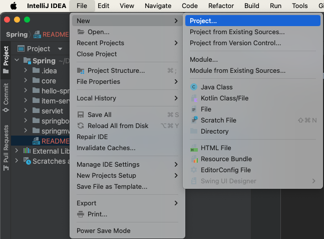
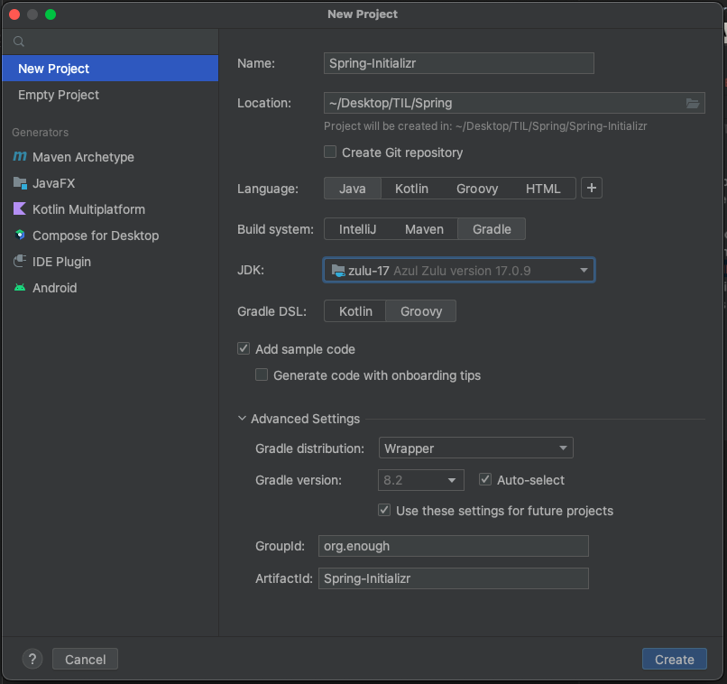
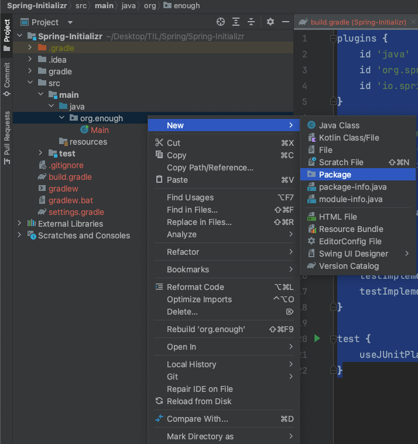
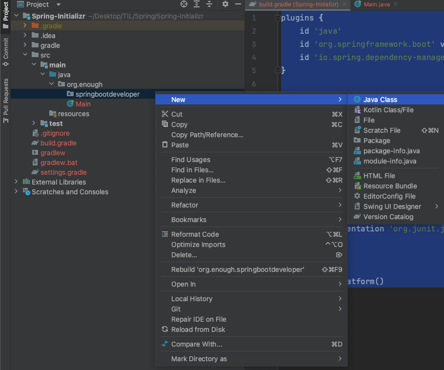

# 프로젝트 생성()
File -> New -> Project...  


<br>

언어: java  
프로젝트: Gradle  
JDK: 17  
나머지 설정값 입력  
  
### **여기까지 스프링 부트3 프로젝트가 아닌 그레이들 프로젝트 생성**


<br>

# 스프링 부트3 프로젝트로 바꾸기
1. build.gradle 파일 수정  
```java
plugins {
    id 'java'
    id 'org.springframework.boot' version '3.0.2'
    id 'io.spring.dependency-management' version '1.1.0'
}

group = 'org.enough'
version = '1.0-SNAPSHOT'
sourceCompatibility = '17'

repositories {
    mavenCentral()
}

dependencies {
    implementation 'org.springframework.boot:spring-boot-starter-web'
    testImplementation 'org.springframework.boot:spring-boot-starter-test'
}

test {
    useJUnitPlatform()
}
```

<br>

2. 새 패키지 생성  
`src/main/java`에서 생성된 패키지 `org.enough`을 우클릭하여 `[New -> Package]`를 선택  
패키지 이름: <그룹_이름>.<프로젝트_이름> => `org.enough.springbootdeveloper`


<br>

3. 생성한 패키지에 스프링 부트를 실행할 용도의 **클래스 생성**  
클래스이름: <**프로젝트_이름**><**Application**> => SpringBootDeveloperApplication  
  

<br>

4. 메인 클래스 작성  
```java
package org.enough.springbootdeveloper;

import org.springframework.boot.SpringApplication;
import org.springframework.boot.autoconfigure.SpringBootApplication;

@SpringBootApplication
public class SpringBootDeveloperApplication {
    public static void main(String[] args) {
        SpringApplication.run(SpringBootDeveloperApplication.class, args);
    }
}
```

<br>

5. 실행
실행 아이콘 클릭 ▶︎(Run 버튼)  


---

<br>

# 추가
`src/main/resources`에서 `application.yml` 생성 후 코드추가
```java
spring:
  jpa:
    show-sql: true
    properties:
      hibernate:
        format_sql: true

    defer-datasource-initialization: true
```

<br>

`build.gradle` dependency 설정
```java
dependencies {
    implementation 'org.springframework.boot:spring-boot-starter-web'
    implementation 'org.springframework.boot:spring-boot-starter-data-jpa'

    runtimeOnly 'com.h2database:h2'

    compileOnly 'org.projectlombok:lombok'
    annotationProcessor 'org.projectlombok:lombok'

    testImplementation 'org.springframework.boot:spring-boot-starter-test'
}
```