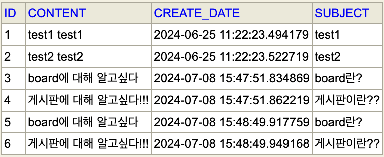

## DB, 코드


```java
@SpringBootTest
class BoardApplicationTests {

	@Autowired
	private QuestionRepository questionRepository;
	
	@Test
	void testJpa() {
		List<Question> all = this.questionRepository.findAll();
		assertEquals(6, all.size());
		
		Question q = all.get(0);
		assertEquals("test1", q.getSubject());
		
	}

}
```

### findAll 메서드
- 테이블에 저장된 모든 데이터를 조회하기 위해 findAll 메서드 사용

### assertEquals 메서드
- 테스트에서 예상한 결과와 실제 결과가 동일한지 확인하는 목적으로 사용
- JPA 또는 데이터베이스에서 데이터를 올바르게 가져오는지 확인
- `assertEquals(기댓값, 실제값)`: 기댓값과 실제값이 동일한지 조사

---
```java
@SpringBootTest
class BoardApplicationTests {

	@Autowired
	private QuestionRepository questionRepository;
	
	@Test
	void testJpa() {
		Optional<Question> oq = this.questionRepository.findById(3);
		if(oq.isPresent()) {
			Question q = oq.get();
			assertEquals("board란?", q.getSubject());
		}
	}

}
```
- Optional은 `isPresent()`로 값이 존재하는지 확인

### findById 메서드
- id값으로 데이터를 조사하기 위해 findById 메서드를 이용
- 리턴 타입 `Optional`: findById로 호출한 값이 존재할 수도 있고, 존재하지 않을 수도 있기 때문

---

## findBy + 엔티티의 속성명
- `findBy + 엔티티의 속성명`, 예를 들어 findBySubject를 리포지토리에 메서드로 작성하면 입력한 속성의 값으로 데이터를 조회할 수 있다

---

### assertTure 메서드
- 괄호 안의 값이 true인지 테스트
- false를 리턴하면 오류가 발생하고 테스트가 종료됨
```java
@SpringBootTest
class BoardApplicationTests {

	@Autowired
	private QuestionRepository questionRepository;
	
	@Test
	void testJpa() {
		Optional<Question> oq = this.questionRepository.findById(1);
		assertTrue(oq.isPresent());
		Question q = oq.get();
		q.setSubject("수정된 제목");
		this.questionRepository.save(q);
	}

}
```