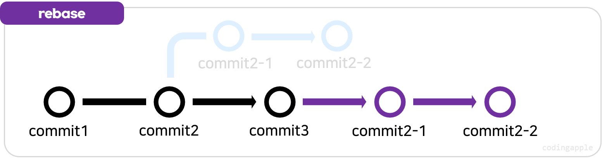

# 3-way merge
- 브랜치에 각각 신규 commit이 1회 이상 있는 경우  
merge 명령을 내리면 두 브랜치의 코드를 합쳐서 commit을 자동으로 생성하는 경우를 3-way merge

<br>

# fast-forward merge
- 새로운 브랜치에만 commit이 있고, 기준이 되는 브랜치에는 신규 commit이 없는 경우가 있다  
이 경우 merge를 하게되면 fast-forward merge라고 한다
- 딱히 합칠게 없어서 신규 브랜치를 기준 브랜치로 하는 것

<br>

### fast-forward merge 싫어요
```
git merge --no--ff 브랜치명
```
- `fast-forward merge`가 싫으면 `git merge --no--ff`명령을 사용하여 강제로 `3-way merge`할 수 있다

<br>

# branch 삭제
```
git branch -d 브랜치이름
git branch -D 브랜치이름
```
- 3-way, fast-forward를 merge해도 브랜치가 자동으로 삭제되지 않는다

<br>

### git branch -d 브랜치이름
- 병합이 완료된 브랜치 삭제

<br>

### git branch -D 브랜치이름
- 병합이 완료되지 않은 브랜치 삭제

<br>

# rebase
- 브랜치의 시작점을 다른 commit로 옮겨주는 행위

1. 신규 브랜치의 시작점을 main/master 브랜치의 최근 commit오 옮긴 다음
2. fast-forward merge 하는 것

<br>

### rebase 사용 이유
1. 3-way merge말고 강제로 fast-forward하고 싶을 때
2. 브랜치 없이도 코드 잘짠다고 보여주고 싶을 때
3. commit 내역을 이어나가고 싶을 때
- 이런 경우 일반 `3-way merge` 대신 `rebase & merge`

<br>

# 그래서 실제로 rebase and merge하는 방법?
```
git switch 새로운브랜치
git rebase main

git switch main
git merge 새로운 브랜치
```
1. 새로운 브랜치로 이동
2. `git rebase main`
3. 새로운 브랜치가 main 브랜치의 최신으로 이동하고 그걸 `fast-forward merge`하면 됨
- 즉, `rebase & merge`는 `강제 fast-forward merge`
- main 브랜치말고 다른 브랜치끼리도 가능

### rebase 단점
- 브랜치끼리 차이가 너무 많은 경우 rebase하면 충돌이 많이발생하여 하나씩 해결하기 힘듬

<br>

# squash and merge
- 모든 브랜치를 3-way merge 하면 대참사가 발생할 수도 있다
    1. 3-way merge 된 것들은 매우 복잡
    2. main 브랜치 `git log`를 출력해보면 3-way merge된 브랜치들의 commit 내역도 다 같이 출력되어 복잡
- 따라서 `rebase` 아니면 `squash and merge`하면 됨
    - 새로운 브랜치에 있던 commit들을 연결하는 것이 아닌  
    main 브랜치에 붙여주기 때문에 위의 1번, 2번의 걱정을 하지 않아도 된다

## squash and merge

- 3-way merge처럼 선으로 이어주지 않고 새 브랜치에 있던 코드변경사항들이 main 브랜치로 이동

<br>

# 그래서 실제로 squash and merge하는 방법?
```
git switch main
git merge --squash 브랜치명
git commit -m '메세지'
```
- --squash 옵션 추가
- 브랜치에서 만들어놨던 많은 commit들을 합쳐서 하나의 commit로 main 브랜치에 생성해준다

<br>

# 정리
- 브랜치 50개 ~ 100개 만들었는지 그냥 `merge`하면 나중에 `git log graph`가 복잡해질 수도 있다
- 이때 `rebase`나 `squash`하면 깔끔