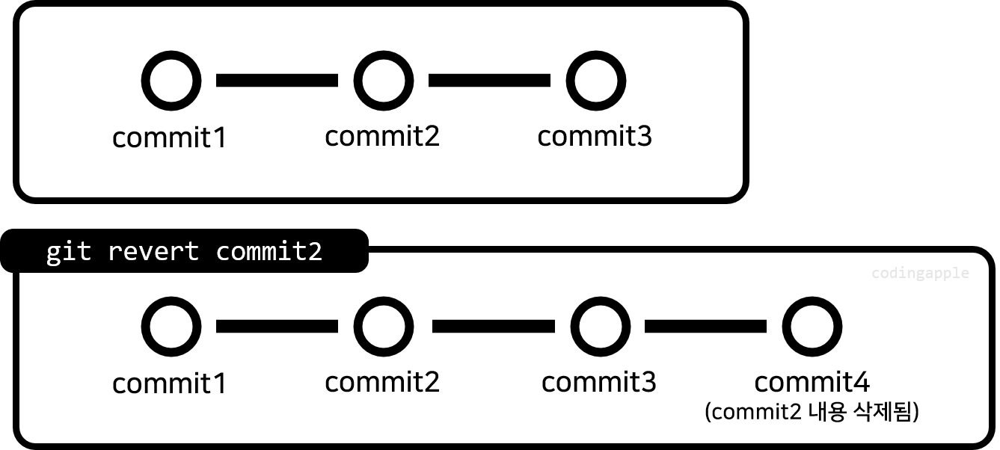
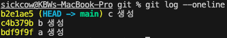

# git 되돌리기
- git은 버전관리 프로그램이기 때문에 언제든지 이전 commit으로 돌아가거나  
문제가 되는 commit 내역을 취소할 수 있다

<br>

# git restore - 파일 하나 되돌리기
- 파일 하나가 잘못되었을 경우 `cmd + z`로 여러 번 눌러도 되지만 수정사항이 너무 많다면 명령어 하나로 처리할 수 있음

<br>

```
git restore 파일명
```
- 최근 commit된 상태로 현재 파일의 수정내역을 되돌릴 수 있다

<br>

```
git restore --source 커밋아이디 파일명
```
- 입력한 파일이 특정 커밋아이디 시점으로 복구된다

<br>

```
git restore --staged 파일명
```
- 특정 파일을 staging 취소할 수 있다(복구랑 상관X)

<br>

# git revert - commit 되돌리기
- `git revert`는 commit을 없애는 것이 아니라 취소한 commit를 생성해준다


<br>

```
git revert 커밋아이디
```
- 커밋아이디에서 일어난 일만 취소해 줌
- 실행 시 에디터가 나오고 커밋 메시지 수정 후 닫으면 됨
- Vim 에디터 나올 경우 수정(i), 나오기(esc), 저장(wq)

<br>

- revert 할 때 동시에 여러 개의 commit id 입력 가능
- 최근 했던 commit 1개만 revert 하고 싶으면 `git revert HEAD`
- merge 명령으로 인해 새로 만들어진 commit도 revert 가능 => merge가 취소됨

<br>

# git reset - 전부 되돌리기
- 특정 commmit 시절로 모든 것을 되돌릴 수 있다


<br>

```
git reset --hard 커밋아이디
```
- 커밋이 생성될 때로 되돌려준다
- 작업 폴더 내의 파일도 해당 시점으로 돌아간다

<br>

- 여러 명이서 협업하는 repository에는 보통 reset을 사용하면 안된다
- untracked 파일은 사라지지 않고 유지된다(git add 안해놓은 파일 유지)
- git clean 명령어는 untracked 파일들도 모두 다 지울 수 있다

### reset 시 옵션 설정(hard | soft | mixed)


```
git reset --hard c4b379b
```
- a, b 파일은 남아있고, c 파일 삭제됨

<br>

```
git reset --soft c4b379b
```
- a, c 파일은 남아있고, b 파일은 staging area에 남아있다
    - commit 할 수 있다

<br>

```
git reset --mixed c4b379b
```
- a, c 파일은 남아있고, b 파일은 staging 되지 않은 상태가 된다
    - git add, git commit 할 수 있다

<br>

### git reset 정리
- `reset`은 파일을 완전히 지우는 것이 아니라
  검토하고 다시 commit하고 싶으면 `--soft` | `--mixed` 사용하면 됨
- `git reset ~`는 `--mixed` 옵션이 자동으로 발동됨