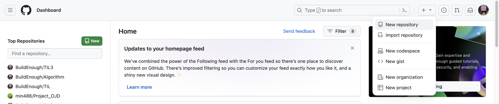
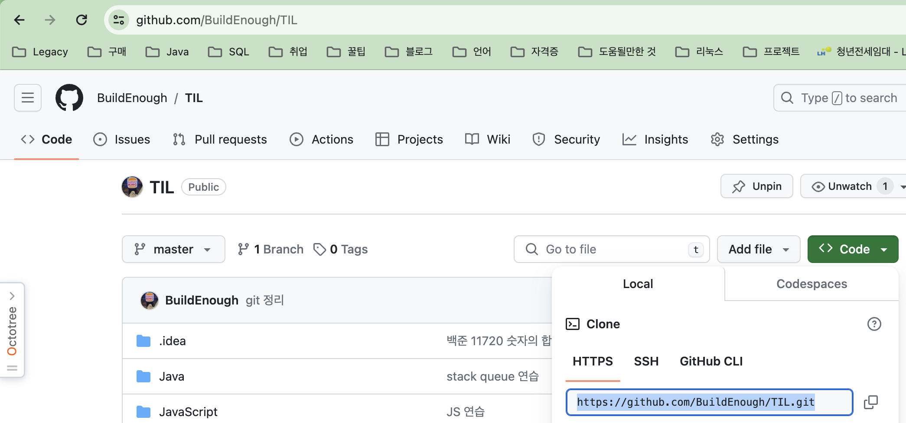

# repository 사용
- git이 파일버전을 저장해두는 장소를 `repository`라고 한다
- 로컬 작업폴더에 `.git`이라는 폴더가 있는데 그것이 `repository`이다

<br>

# 온라인 repository
- 실제 개발할 때 `온라인 repository`를 많이 사용
- 로컬 컴퓨터에 만들어 놓은 `git repository`를 온라인으로 저장해두는 것
1. 본인이 사용하는 컴퓨터가 고장나도 안심
2. 다른 사람과의 협업 가능

<br>

# github 가입
- [깃허브](https://github.com/)에 가입 후 로그인
- 우측 상단 + 버튼 클릭 후 New repository 선택

- Repositroy name과 같은 필수 사항만 입력 후 확인

<br>

# repository 생성
1. 로컬 컴퓨터에서 작업폴더를 하나 생성 후 열어 `git init`하기
    ```
    git init
    ```
    - 로컬 repository 생성
2. `github.com`은 기본 branch 이름을 `master`가 아닌 `main`으로 사용하라고 하긴함
    ```
    git branch -M main
    ```
    - 로컬 작업폴더에 있는 기본 branch 이름을 `main`으로 변경
    - 굳이 안해도 되긴함

<br>

# Github에서 만든 원격 저장소에 올리기
- 로컬 저장소 -> 원격 저장소로 업로드 하고 싶은 경우
- 작업 폴더에서 터미널 열기

<br>

```
git push -u 원격저장소주소 main
```
- 로컬저장소의 main 브랜치를 원격저장소에 올리라는 명령(다른 브랜치도 가능)
- 이때 github 로그인하라고 나오면 로그인하면 됨
- `-u` 옵션은 방금 입력한 주소를 기억해두라는 의미
    - 한 번 입력한 이후론 `git push`까지만 입력해도 작동함

<br>

- 원격저장소 주소는 본인 repository에 들어간후 URL에 `.git`을 더해주면 끝

    - 그림에서는 URL 주소(https://github.com/BuildEnough/TIL)에 `.git`을 더한 `https://github.com/BuildEnough/TIL.git`
    - `HTTPS`를 선택하여 나오는 것을 입력해도 됨

<br>

# 원격저장소 주소 항상 입력하는거 귀찮다잉
- `https://github.com/BuildEnough/TIL.git` 매번 입력하기 귀찮..다
- 이럴 땐 저장소 주소를 `변수`에 저장하여 사용할 수 있다

<br>

- 터미널에 `git remote add 변수명 저장소주소` 입력
    ```
    git remote add origin https://github.com/BuildEnough/TIL.git
    ```
    - `https:// ~~~`주소가 필요할 때마다 `origin`이라는 변수명을 사용할 수 있다
    - 즉 `git push -u origin main`이렇게 입력 가능
- `-u`옵션은 입력한 주소를 기억하라는 명령으로 1번 입력했다면  
다음 명령에서 `git push`까지만 입력해도 동작한다

<br>

- 변수목록 확인
    - `git remote -v` 입력

<br>

# 원격저장소에 있는 것 그대로 내려받기
```
git clone https://원격저장소주소
```
- clone는 초기설정하기 귀찮을때 repository 생성시 README.md 파일을 생성 후  
로컬 컴퓨터에서 clone를 사용하면 초기설정 없이 사용가능하다

<br>

# gitignore
- 원격저장소를 효율적으로 사용하고 싶으면 쓸모없는 파일은 commit해서 올리지 않는게 좋다
- `.gitignore`파일을 하나 생성하면 저장소에 올리지 않을 파일들을 쉽게 명시가능하다
- 명시된 파일들은 `git add .`해도 staging이 되지 않아 편리하다