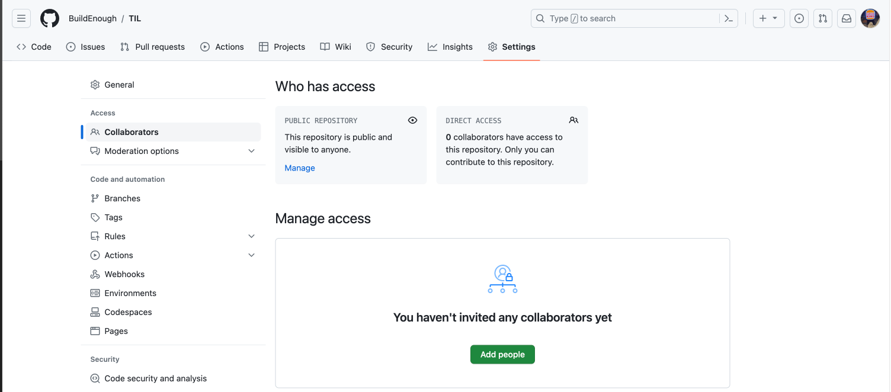

# 협업
- 원격저장소의 장점은 다른 사람들과 협업할 수 있다는 것
- 개발자 여러 명이서 작업한 내용을 원격저장소에 올리는 것이 협업 그 자체
- 타인이 코드 작성 후 `git push` 하는게 협업

<br>

# Github 협업 Setting
- 협업 시 해당 repository에 `Settings`에서 `Collaborators`에서 `Add people`로 팀원을 추가

- 다른 팀원도 github 아이디가 필요하고 해당 팀원의 아이디를 `Collaborators` 메뉴에 등록해야 함

<br>

# clone
팀원(타인) 기준
- 기존 소스코드가 없는디 어떻게 개발?
    - 기존 소스코드를 다운받아 시작할 수 있다

<br>

```
git clone 원격저장소주소
```
- 새로운 작업폴더에 입력
- 원격저장소에 있던 내용을 그대로 복사해줌

<br>

```
$ git clone --branch 특정브랜치명 원격저장소주소
또는 
$ git clone --b 특정브랜치명 원격저장소주소

```
- 특정 브랜치만 `clone`

<br>

# git pull 팀원이 commit 하려는데 오류 발생?
- `git push`는 그냥 할 수 있는게 아니다
    - 팀원 제외한 다른 사람이 원격저장소에 파일을 올리면 `git push` 못 함
- 즉, `원격저장소` vs `로컬저장소` 내용이 다르면 로컬저장소에서 `git push`가 안된다
    - 만약 `git push`가 된다면 코드가 꼬여버릴 수 있어서 미리 예방해 주는 것


## git pull
- `원격저장소`에 있던 모든 branch 내용을 가져와서 `로컬저장소`에 합치라는 명령

<br>

```
git pull 원격저장소주소
```
- `로컬`이 `원격저장소` 내용을 반영한 최신상태가 되기 떄문에 `git push`가 가능하다
- 즉, 변동사항이 있다면 `git pull`하고나서 `git push`하면 됨

<br>

```
git pull 원격저장소주소 브랜치명
```
- 특정 branch만 가져올 수 있다

<br>

- 예전에 `-u` 옵션을 입력했다면 `git pull`, `git push`까지만 입력해도 됨
- `origin`이라는 변수명을 등록했다면 `원격저장소주소` 대신 사용가능

<br>

# git pull =  git fetch + git merge
- `git pull`을 입력하면 자동으로 `git fetch` + `git merge` 해 줌

<br>

### git fetch
- 원격저장소에 있는 commit 중에 로컬에 없는 commit를 가져오라는 명령

<br>

### conflict 발생
- `git pull` 할 때 팀원 2명이서 파일을 건드릴 경우 `merge conflict`가 발생할 수 있다
- 충돌발생한 부분 고쳐서 다시 commit하면 해결됨 -> 5_git merge, branch 삭제 가보기