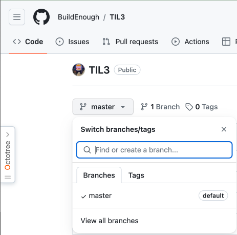
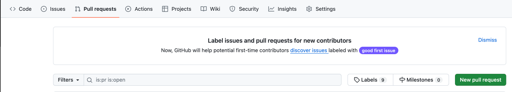
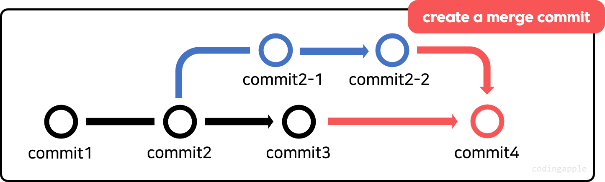
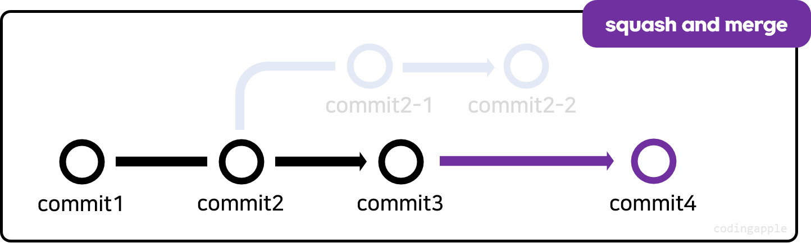
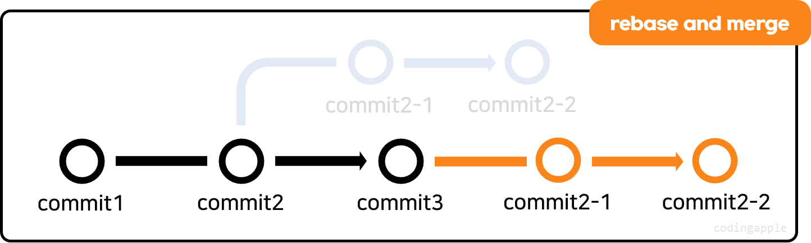

# branch

- 새로운 기능을 만들고 싶으면 `main/master` 브랜치가 아닌  
다른 브랜치에 개발하는 것이 안전하다

1. 원격 repository에서 생성
    - `gitjub.com`에서 생성 가능

2. 로컬에서 생성
    - 로컬에서 만든 브랜치를 원격에 올리기
    
    <br>

    - 새로운 브랜치 생성후 commit
    ```
    git branch 새로운브랜치이름
    git switch 새로운브랜치

    git add .
    git commit -m '메시지내용'
    ```

    <br>

    - 로컬 브랜치 원격에 올리기
    ```
    git push 원격저장소주소 로컬브랜치명
    ```
    - `git push 원격저장소주소 로컬브랜치명`: 특정 로컬저장소의 브랜치 -> 원격저장소
    - `git push 원격저장소주소`: 모든 로컬저장소의 브랜치 -> 원격저장소

<br>

# Pull request
- 생성된 브랜치를 `main/master` 브랜치와 합쳐야 기능이 완성됨
- 합치려면 `git merge` -> `git push`이지만  
팀끼리 일하는 경우 `merge`하기 전에 검토 및 토론해야하는 경우 생김
- 그래서 `github.com`은 `pull request`라는 기능 존재

<br>

- 생성된 브랜치를 `merge`해달라는 요청을 할 수 있고  
팀원끼리 `merge`전에 코드검토 가능

<br>

## github.com에서 pull request

1. 상단 Pull requests 메뉴에서 초록버튼(New pull requset) 누르면 `pull request` 생성
2. 어떤 branch를 어디에 합칠건지 선택
    - 하단의 commit 내역, 변경 내역 확인
    - 초록버튼(Create pull request) 선택
3. Pull requests 메뉴에서 확인 가능
    - 코드 리뷰 가능
4. merge 하기로 했으면 `Create(3-way)`, `Squash`, `Rebase` 중에서 하나 선택
    - create a merge commit
    
    - squash and merge
    
    - rebase and merge
    

<br>

# 정리
- github, 원격 저장소에서도 branch 생성 가능
- Pull request(merge)할 때 3개 중 원하는대로 선택

<br>

# 그 외
- 원격저장소의 commit 내역을 과거로 되돌리고 싶음
    - 로컬에서 `git reset --hard`, `git push -f`하면 가능하긴 한데  해당 브랜치를 공동작업중인 사람들이 모두 영향받기 때문에 그러지 않는게 좋다
- `github.com` 사이트에 `revert 버튼`이 있긴 함
    - 예전 코드로 되돌려주는 commit을 만들어주는 식으로 동작