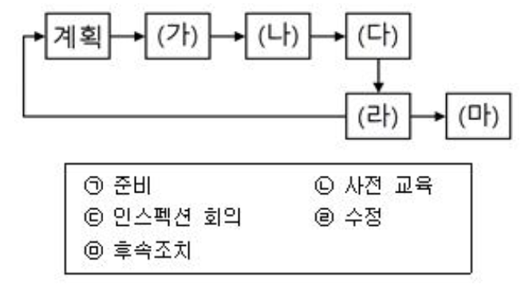

## 문제
다음은 인스펙션(Inspection) 과정을 표현한 것이다. (가)~(마)에 들어갈 말을 보기에서 찾아 바르게 연결한 것은?

1. (가) - ᄂ, (나) - ᄃ
2. (나) - ᄀ, (다) - ᄃ(O)
3. (다) - ᄃ, (라) - ᄆ
4. (라) - ᄅ, (마) - ᄃ

## 풀이
가 - 사전교육  
나 - 준비  
다 - 인스펙션 회의  
라 - 수정  
마 - 후속조치  

계획 -> 사전교육 -> 준비 -> 인스펙션 회의 -> 수정 -> 후속조치