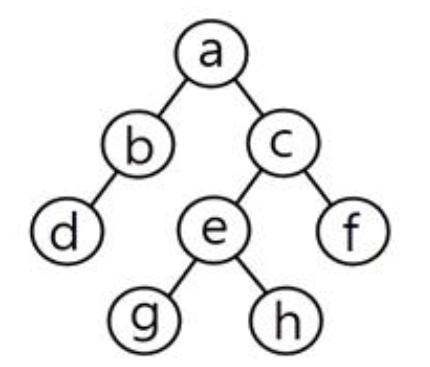

## 문제
아래 Tree 구조에 대하여 후위 순회(Postorder)한 결과는?

1. a→b→d→c→e→g→h→f
2. d→b→g→h→e→f→c→a(O)
3. d→b→a→g→e→h→c→f
4. a→b→d→g→e→h→c→f

## 풀이
전위 운행 (PreOrder) => Root, Left, Right 순서  
중위 운행 (InOrder) => Left, Root, Right 순서  
후위 운행 (PostOrder) => Left, Right, Root 순서

pre_order (전위순회) : 뿌리 먼저 방문  
in_order (중위순회) : 왼쪽 하위 노드 방문 후 뿌리 방문   
post_order (후위순회) : 하위 노드 모두 방문 후 뿌리 방문  