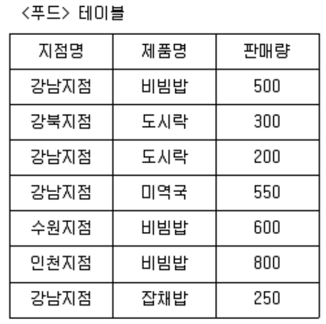

## 문제
다음 테이블을 보고 강남지점의 판매량이 많은 제품부터 출력되도록 할 때 다음 중 가장 적절한 SQL 구문은? (단, 출력은 제품명과 판매량이 출력되도록 한다.)

1. SELECT 제품명, 판매량 FROM 푸드 ORDER BY 판매량 ASC;
2. SELECT 제품명, 판매량 FROM 푸드 ORDER BY 판매량 DESC;
3. SELECT 제품명, 판매량 FROM 푸드 WHERE 지점명 = '강남지점' ORDER BY 판매량 ASC;
4. SELECT 제품명, 판매량 FROM 푸드 WHERE 지점명 = '강남지점' ORDER BY 판매량 DESC;(O)

## 풀이
```sql
SELECT 제품명, 판매량 FROM 푸드 WHERE 지점명 = '강남지점' ORDER BY 판매량 DESC;
```