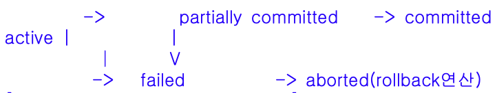

## 문제
트랜잭션의 상태 중 트랜잭션의 마지막 연산이 실행된 직후의 상태로, 모든 연산의 처리는 끝났지만 트랜잭션이 수행한 최종 결과를 데이터베이스에 반영하지 않은 상태는?
1. Active
2. Partially Committed(O)
3. Committed
4. Aborted

## 풀이
Partially Committed
- 마지막 연산이 실행된 직후의 상태로 아 직 Commit 연산 실행 전

Committed
- 트랜잭션이 실행을 성공적으로 완료하여 Commit 연산을 수행한 상태

