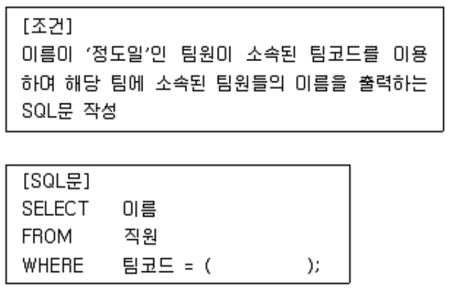

## 문제
다음 [조건]에 부합하는 SQL문을 작성하고자 할 때, [SQL문]의 빈칸에 들어갈 내용으로 옳은 것은? (단, '팀 코드' 및 '이름'은 속성이며, '직원'은 테이블이다.)

1. WHERE 이름 = '정도일'
2. SELECT 팀코드 FROM 이름 WHERE 직원 = '정도일'
3. WHERE 직원 = '정도일'
4. SELECT 팀코드 FROM 직원 WHERE 이름 = '정도일'(O)

## 풀이
```sql
SELECT 팀코드 FROM 직원 WHERE 이름 = '정도일'
```