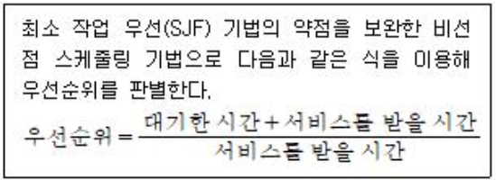

## 문제
다음에서 설명하는 프로세스 스케줄링은?

1. FIFO 스케줄링
2. RR 스케줄링
3. HRN 스케줄링
4. MQ 스케줄링

## 풀이
HRN 스케줄링 방식
- 비선점 스케줄링
- 실행시간이 긴 프로세스에 불리한 SJF을 보완하기 위해 대기시간 및 서비스 시간을 이용
- 긴 작업과 짧은 작업 간의 지나친 불평등을 해소할 수 있다
- 우선순위를 계산 숫자가 높은것부터 낮은순으로 순위 부여
- (대기시간 + 서비스시간) / 서비스시간 = 우선순위값 값이 클수록 우선순의가 높다

# 156 주요 스케줄링 알고리즘
### HRN(Hightest Response-ratio Next)
실행 시간이 긴 프로세스에 불리한 SJF 기법을 보안하기 위한 것으로, 대기 시간과 서비스 시간을 이용하는 기법
- 우선순위 계산 공식을 이용하여 서비스 시간이 짧은 프로세스나 대기 시간이 긴 프로세스에게 우선순위를 주여 CPU를 할당한다
- 서비스 실행 시간이 짧거나 대기 시간이 긴 프로세스일 경우 우선순위가 높아진다
- 우선순위를 계산하여 그 숫자가 높은 것부터 낮은 순으로 우선순위가 부여된다
- (대기시간 + 서비스시간) / 서비스시간 = 우선순위