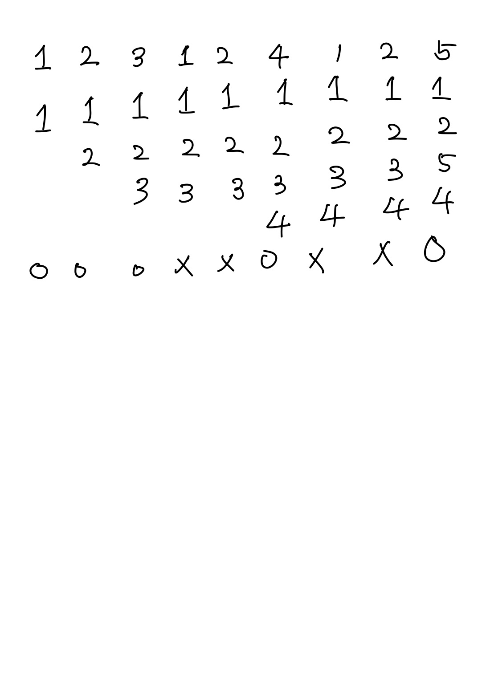

## 문제
4개의 페이지를 수용할 수 있는 주기억장치가 있으며, 초기에는 모두 비어 있다고 가정한다.  
다음의 순서로 페이지 참조가 발생할 때, LRU 페이지 교체 알고리즘을 사용할 경우 몇 번의 페이지 결함이 발생하는가?  

```페이지 참조순서 1, 2, 3, 1, 2, 4, 1, 2, 5```

1. 5회(O)
2. 6회
3. 7회
4. 8회

## 풀이


# 152 가상기억장치 구현 기법 / 페이지 교체 알고리즘
### LRU(Least Recently Used)
- LUR는 최근에 가장 오랫동안 사용하지 않은 페이지를 교체하는 기법
- 각 페이자마다 계수기(Counter)나 스택(Stack)을 두어 현 시점에서 가장 오랫동안 사용하지 않은, 즉 가장 오래 전에 사용된 페이지를 교체한다